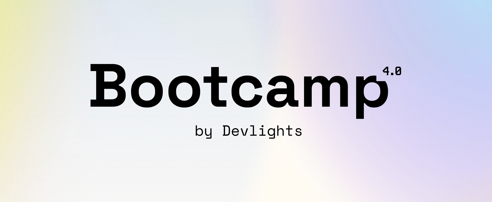

Exercises and activities from the Bootcamp 4.0 by Devlights

## Guide
- Exercises 1 - Class 1 and 2: Types, Conversions, Operators and Flow Control
- Exercises 2 - Class 4: Lists, Arrays, Dictionaries, Queues, Stacks